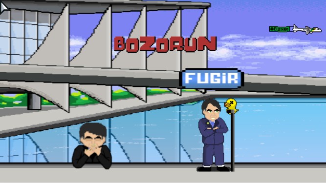

## I got laid off last December.

The whole team, actually. I thought it would be easier to get a new job but I was wrong. The market right now if full of excellent engineers looking for a new role. 

Companies with open roles are overwhelmed with applications, they are taking longer to answer than ever before.

Even companies without financial insecurities are laying people off. They are using this seasonal situation to rub down on costs. It would look bad to do it in another situation.

I decided to brush up my personal website. Maybe it helps me differ from the crowd.

[I've blogged in the past!](https://dremendes.wordpress.com) (in portuguese)

## WORK

### Bozorun

[Code](https://github.com/dremendes/bozorun) 

